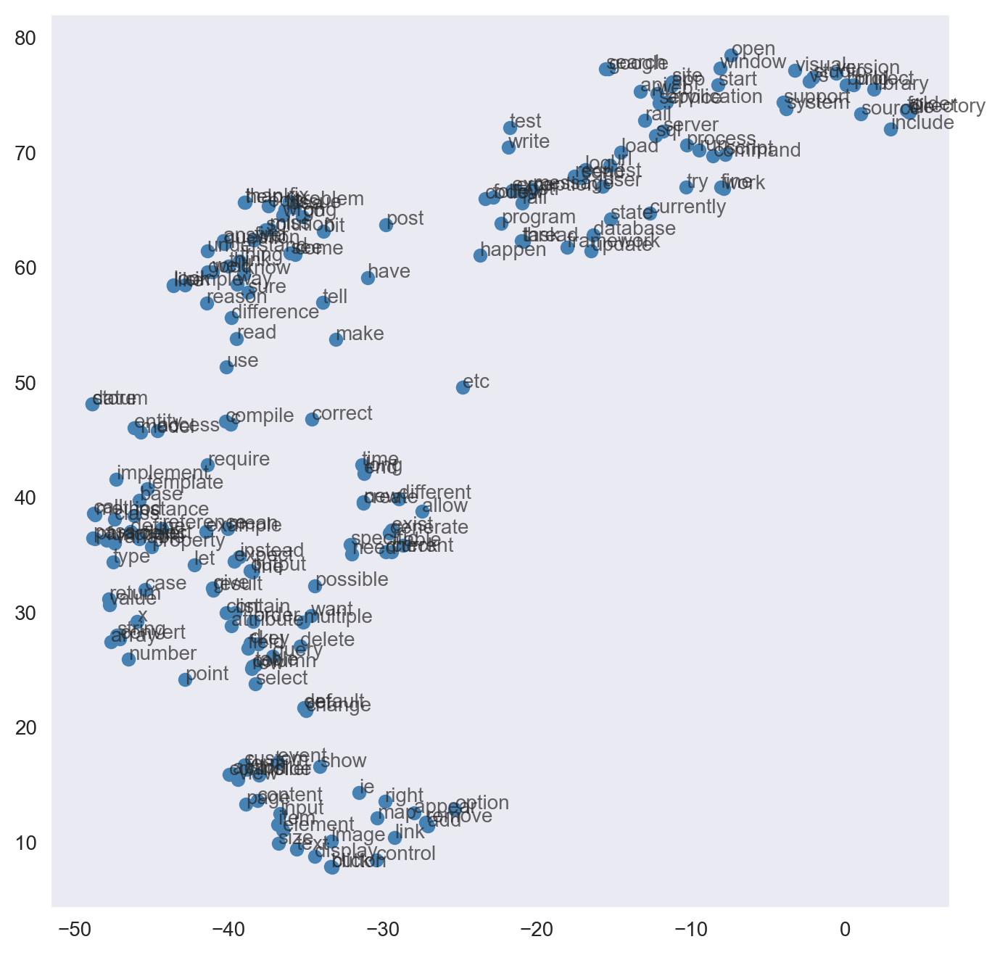
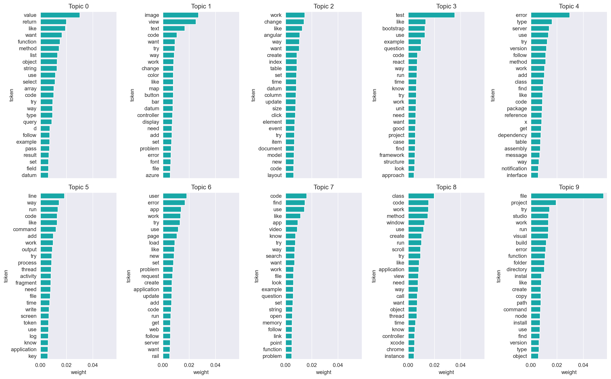
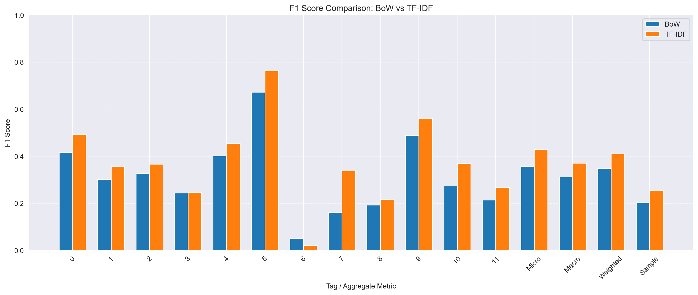
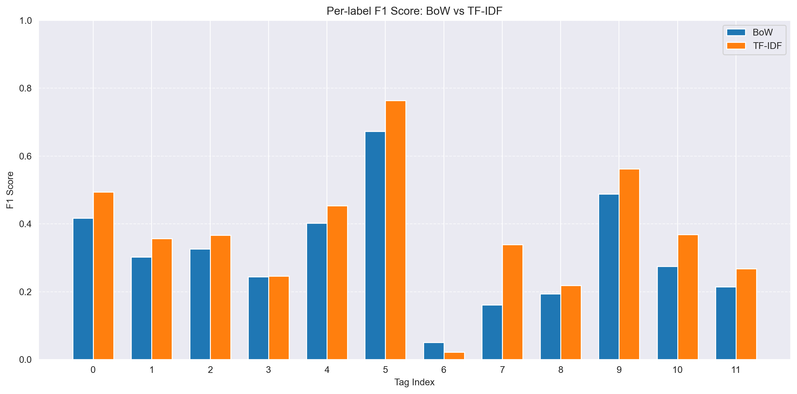
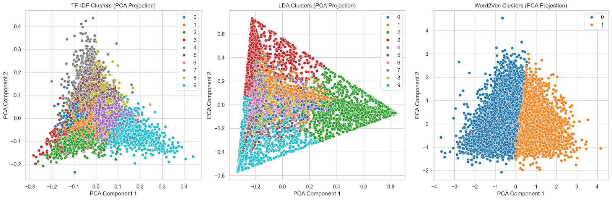

# Machine Learning Applications

## Final Project: **Stack Overflow Tag Classification & Clustering**

---

**Jorge Chamorro Pedrosa – 100496527**  
**Juan José Jiménez De Juan – 100496468**  
**Mario Coronado Fernández – 100496637**  
**Mario Fernández Busto – 100496459**

---

### Index:

1. Text Preprocessing and Vectorization  
   1.1 Text Preprocessing  
   1.2 Natural Language Processing  
2. Machine Learning Models  
   2.1 Classification  
   2.2 Clustering  
3. Dashboard  

---

## 1. Text Preprocessing and Vectorization

### 1.1 Text Preprocessing

**THE DATASET**  
During this project we considered different datasets and approaches to creating our own. We decided to work with Stack Overflow data, as it is a platform we frequently use and one that offers a rich source of user-generated content. Stack Overflow is a forum where users can post technical questions and provide answers across a variety of topics.  
We did not use any web scraping tools or techniques. Instead, we relied on the openly available Stack Overflow dataset, which is distributed in structured csv files. For this project, we got three files: Tags, Questions, and Answers. These datasets include the following information, respectively:  
- Question IDs  
- Tag associations  
- User IDs  
- Question titles  
- Question bodies  
- Timestamps (creation and close dates)  
- Question scores  
- Answer bodies  

In total, we processed over 1 million questions along with their corresponding answers and metadata.

**PREPROCESSING**  
Before applying Natural Language Processing (NLP) techniques and text vectorization, we performed essential data cleaning and some feature engineering steps.  
The dataset exhibits two key one-to-many relationships:

- **Tags**: Each question can have multiple tags, but they are stored in separate rows. We grouped these tags into a list for each question based on the question ID.  
- **Answers**: Each question can have multiple answers. To simplify the structure, we concatenated all answers into a single string per question, using a separator to distinguish between individual answers.  

Next, we merged all the files—Questions, Answers, and Tags—using the question ID as the primary key.  
After merging, we dropped unnecessary columns such as OwnerUserId and ClosedDate. The former was not relevant to our analysis since we used the question ID for identification, and the latter was often missing, as many questions remained open.  

To handle missing values, we adopted a context-aware approach. If the concatenated answers field was missing, this simply indicated that the question had not received any answers. Rather than dropping these rows, we treated the absence of answers as a valid case by replacing missing values with an empty string (""). Additionally, we introduced a new feature, `NumAnswers`, to represent the number of answers per question. This feature may be informative in modeling, as questions with zero answers might reflect low popularity or high difficulty.  

To further clean the dataset, we filtered out questions with scores below a certain threshold. Our reasoning was that:
- Higher or lower scores typically mean the community cared enough to vote significantly — either good or bad.  
- Since we have +1,000,000 observations this can help filter down to more "important" or interesting ones without random sampling.  

The Tags column is especially important for our project goal. Upon inspection, we noticed that there were over 22,394 tags, where many of them just figure in a few questions. Therefore, in order to reduce the number of unique tags associated with each question by focusing on the most frequent and informative ones. We did so by trying to cover a significant portion (50%) of the questions in the dataset, then prune the tags associated with each question, keeping only these top tags and assigning the tag "other" if a question's tags are not among the most frequent ones. This process is also showcased in the submitted notebook.  

With the dataset cleaned and preprocessed, at first sight our task was to predict the category of a question based on its title, body, and associated answers. The category is defined using the refined set of tags, representing the main topics associated with each question.  
However, further processing was required for the specific <a href="https://github.com/coronado04-collab/ml-apps/edit/main/report.md#21-classification"> classification part </a>.

**TEXT PROCESSING**  
Although the dataset was relatively clean—being directly provided by Stack Overflow rather than scraped from HTML—we still performed additional preprocessing to ensure text quality for the following NLP tasks. Specifically, we wanted to eliminate any remaining HTML tags, URLs, code blocks, and other noisy elements that could affect the quality of tokenization and vectorization.  
To achieve this, we developed a utility function called `wrangle_text`, which performs comprehensive text cleaning, i.e., remove code blocks, HTML tags, URLs, expand contractions, lowercase, etc. We also defined a secondary function, `wrangle_answers`, to clean concatenated answers applying `wrangle_text` to each part individually. Since answers were merged into a single string using ‘ ||| ’ as a separator.  

Then, we moved into constructing our SpaCy pipeline, in our case we used the well known `en_core_web_md` model. This pipeline contains the following attributes: tok2vec, tagger, parser, attribute ruler, lemmatizer and NER (Named Entity Recognition). We also added after the NER component a customized pipe called `normalize_doc_component`, which, as its name suggests, normalizes each doc and returns the final tokens we will use in our text vectorization. This function is basically the lemma of a given token if it has a vector, is alphanumeric, is not a punctuation mark, is not a stopword and is not an entity.  

The pipeline ended up having the attributes and then, it was run on the documents. We apply the pipeline to all the questions in the dataset, using the method `nlp.pipe` with a batch size of 100 to speed up the computation.

### 1.2 Natural Language Processing

**TEXT VECTORIZATION**  
After our text preprocessing we moved into text vectorization. Once we have our tokenized sentences, we created a dictionary using Gensim (Řehůřek 2022), initially with a size of 10,805 words. Then we removed words that appeared less than 2 times per document and those words present in more than 80% of the documents, since they are irrelevant or too common, respectively. We finally ended with a dictionary of 6,379 terms.  

Next, we applied Bag-of-Words (BoW) vectorization using tokenized text as input to Gensim's BoW model. Given the large vocabulary size in our dataset, the resulting corpus was high-dimensional but provided a solid baseline for representing textual data. We then used this corpus to construct a TF-IDF model. We saved the sparse representations as a SciPy Compressed Sparse Column (CSC) matrix for storage and computation. This will be our input for the latter machine learning models.  

Following this, we applied Word2Vec vectorization, also using Gensim. Due to the relatively large and diverse vocabulary in our dataset—stemming from both questions and answers—we decided to use a vector size of 200, a window size of 5, and a minimum word frequency of 5 to reduce noise from rare terms (i.e. technicisms) and achieve more expressive embeddings for our tasks.  

While the size of our dictionary is relatively large, which can support more expressive embeddings, the fact that Stack Overflow content often follows specific syntactic and technical patterns could still limit the diversity of semantic relationships. To visualize the learned embeddings, we used t-SNE to project the high-dimensional vectors into 2D space, enabling qualitative evaluation of semantic groupings.

This allowed us to apply Latent Dirichlet Allocation (LDA), which is a key focus of this project. LDA allows us to study tags within the dataset and assess the quality of our document vectorization by evaluating how well the extracted topics align with meaningful thematic structures.  

---

## 2. Machine Learning Models

### 2.1 Classification

We implemented two baseline classifiers: Logistic Regression and Support Vector Classifier (SVC), using one model per label and One vAll strategies respectively. However, both approaches demonstrated poor performance in the multi-class context of our dataset.

The main problem arises from the class imbalance and high label cardinality. With thousands of possible tags—many of which appear only few of times—it becomes very unlikely for a model to correctly predict rare labels. This issue is especially important in the SVC setup, where one classifier is trained per tag. If a tag has very few positive examples, the classifier struggles to generalize and often defaults to predicting the negative class.

The Logistic Regression model suffers from a different but related problem. It consistently results in high accuracy scores (i.e., ~0.99). This is also caused by the imbalance: since the vast majority of labels are "absent" (i.e., 0), the model learns to predict the negative class for almost all samples. While this results in high overall accuracy, it fails to capture the actual signal, especially for rare tags.

To address this issue, we applied a frequency thresholding strategy. Specifically, we filtered out rare tags by keeping only those that appeared at least 350 times in the dataset.

By removing underrepresented tags, we improved the model’s ability to learn meaningful patterns and generalize better, since there were now enough examples per tag to support effective training.

#### Validation Methodologies

Regarding the validation methodologies for adjusting hyperparameters, we applied train test splitting and cross validation with grid search.

#### Train Test Split

First, we divided the preprocessed dataset into a training and test set, to prevent information leakage and allow to estimate how well the model generalizes to unseen data.

#### Grid Search with Cross Validation

In order to prevent overfitting during tuning and find the best-performing model configuration. In our case we used:

- 5 folds for Logistic Regression  
- 3 folds for Support Vector Classification (high computational cost)

### Vectorization Techniques

Once solved, we trained and compared classifiers — Support Vector Classifier (SVC) and Logistic Regression — using different text vectorization techniques: Bag of Words (BoW), GloVe, and TF-IDF. This will allow us to see and understand how different vectorization techniques affect model performance, and which one suits best – pure word frequency, semantic relationships between words based on global corpus statistics, or relative importance of a word in a document compared to the whole corpus.

We will discard the GloVe vectorization beforehand, since the results where bad, this could be because it is based on global corpus statistics, and too niche areas aren’t well captured.

Both classifiers were wrapped in a multi-label setting, using either OneVsRestClassifier (for SVC) or fitting one binary classifier per label (for Logistic Regression).

To evaluate the performance of our models, we used several metrics: accuracy, ROC curves, confusion matrices, as well as micro-averaged and macro-averaged precision, recall, and F1-scores. These metrics allowed us to assess both overall model performance and how well individual tags were predicted, especially considering class imbalance.

## Results

| Vectorizer | Classifier         | Accuracy | F1-score (macro) | Precision | Recall |
|------------|--------------------|----------|------------------|-----------|--------|
| BoW        | SVC                | 38.03%   | 0.31             | 0.47      | 0.24   |
| TF-IDF     | SVC                | 43.62%   | 0.37             | 0.61      | 0.28   |
| BoW        | Logistic Regression| 95.94%   | 0.25             | 0.45      | 0.21   |
| TF-IDF     | Logistic Regression| 96.42%   | 0.29             | 0.57      | 0.21   |

The results favour TF-IDF representation, this could be because it reduces the weight of common, less informative words, helping the model focus on domain-specific terms which is sufficient to perform the classification.

### 2.2 Clustering

In this section, we addressed the clustering problem by representing the text data using three different approaches: TF-IDF, LDA, and Word2Vec. We applied KMeans clustering to each representation, exploring different values of `k` and evaluating performance through inertia and silhouette scores. To facilitate visualization and gain further insights, we also applied Principal Component Analysis (PCA) to reduce the dimensionality of the data and visually inspect the resulting clusters. Additionally, we analyzed the top terms of each cluster to better interpret the document groupings.

**Clustering result**

| Method   | Range k | Best K | Silhouette Score |
|----------|---------|--------|------------------|
| TF-IDF   | (1,10)  | 10     | 0.007            |
| LDA      | (1,20)  | 10     | 0.44             |
| Word2Vec | (1,10)  | 2      | 0.114            |

**TOP TERMS PER CLUSTER**

**TF-IDF**  
The text below shows the top terms identified for some clusters based on the TF-IDF method. These terms reflect the most important words associated with each cluster, which often correspond to specific topics or themes within the dataset:

- Cluster 0 (Database/SQL): table, column, query, database, sql, entity, row, migration, index, model  
- Cluster 1 (Programming/Functions): string, value, character, number, line, function, format, return, date, list  
- Cluster 2 (Object-Oriented Programming): class, object, type, method, function, test, constructor, parameter, variable, static  

**LDA**  
Below are the top terms for the first two clusters identified using the LDA method, highlighting the key themes for each cluster. Both clusters share some common topics, such as the focus on coding, testing, and project work, indicating that they likely involve overlapping areas of software development. This shared vocabulary emphasizes themes like functions, methods, and files, which are essential concepts in programming and project management.

**Cluster 3 (Software Elements & Project Work):**  
- Topic 6: work, use, element, like, set  
- Topic 0: class, method, function, use, like  
- Topic 8: view, code, use, work, like  
- Topic 7: file, work, use, project, version  
- Topic 5: number, table, use, value  

**Cluster 9 (Code and Object-Oriented Programming):**  
- Topic 0: class, method, function, use, like  
- Topic 2: type, object, value, use, array  
- Topic 7: file, work, use, project, version  
- Topic 1: test, code, use, like, need  
- Topic 6: work, use, element, like, set  

**WORD2VEC**  
To interpret the Word2Vec-based clusters, we applied two complementary methods:
1. Extracting the most frequent terms from representative documents in each cluster.  
2. Retrieving the most similar words to the cluster centroids using the Word2Vec model.  

However, since we only used 2 clusters, the resulting groups are quite broad, and the terms appear very general, often lacking specific semantic separation. When we attempted to increase the number of clusters, the Silhouette Score worsened, indicating that the additional clusters did not provide better separation or clarity.

**CLUSTER VISUALIZATION USING PCA PROJECTION**  
This visualization compares the clusters generated by the three different methods after dimensionality reduction using PCA. Each plot highlights the distinct grouping patterns in the data.

Here we can take different insights on the effects of text representation using clustering:

With TF-IDF there is an internal variation between clustering (heteregeneous), which could be expected as TF-IDF lacks semantic understanding. The fact that we can still differentiate between clusters implies that there are still keyword usage patterns (e.g., Java questions having terms like JVM, Spring).

We know that LDA is a topic model that assumes documents are mixtures of topics. In this case the representation, together with LDA, could suggest that the “base” is made of well differentiated documents (e.g., only Java  or C++), and the “homogeneous” cluster contains more generic programming questions that span multiple domains.

Lastly, word2vec gives semantic embeddings, suggesting the presence of a strong latent semantic dichotomy.

---

## 3. Dashboard

*(Section intentionally left blank in source)*

## References

### Code and Templates Provided by Instructors
- Jupyter notebooks and templates provided during the “Applications of Machine Learning” course.

### Libraries and Frameworks
- [SciPy](https://scipy.org/)
- [scikit-learn](https://scikit-learn.org/stable/)
- [Gensim](https://radimrehurek.com/gensim/)
- [SpaCy](https://spacy.io/)
- [t-SNE](https://lvdmaaten.github.io/tsne/)
- [Plotly Dash](https://plotly.com/dash/)

### External Assistance
- [ChatGPT - Large Language Model](https://chat.openai.com/)

